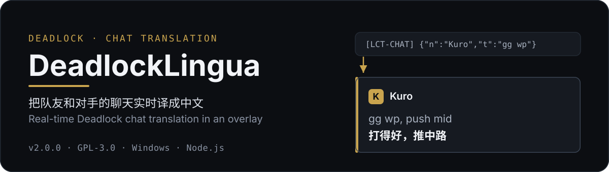
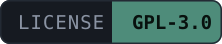
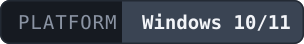
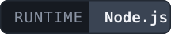
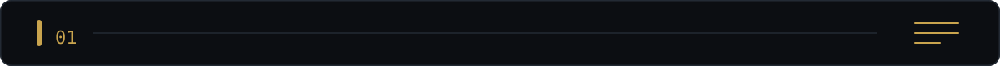
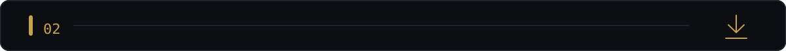
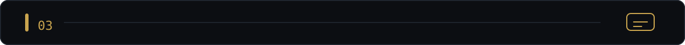
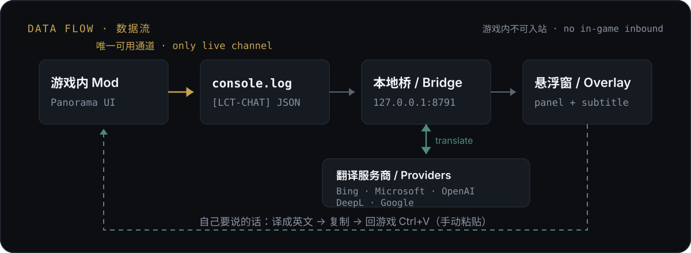

# DeadlockLingua

<p align="center">
  
</p>

<div align="center"></div>

<p align="center">
🇨🇳 <a href="./README.md">简体中文</a> | 🇺🇸 <a href="./README_EN.md">English</a>
</p>

> Real-time chat translation for *Deadlock*, based on [BabelTower](https://github.com/c1375rick/BabelTower), maintained by [Thirt927](https://github.com/Thirt927).

Translates your teammates' and opponents' chat into your language in real time and shows it in an **overlay outside the game**. You can also write in your own language, get it translated, and paste it into the game chat.

> [!WARNING]
> **Since v2.0.0, translations are no longer shown inside the game.**
> The **2026-10-01 Deadlock update removed all networking from the game** (`$.AsyncWebRequest` now throws `AsyncWebRequest has been removed.`), so the mod can no longer receive any data from inside it. Therefore:
> - ❌ Chat lines in the game no longer show translations, and the old `/tr` settings panel has been removed — there is no in-game settings entry any more
> - ✅ Translations are shown in the **overlay window outside the game** — the only approach that still works
>
> This is an engine-level limitation, not a design choice. If a future game update restores networking, in-game translation becomes possible again (`probeInboundChannels()` will detect it immediately).

---

## Table of Contents

- [Features](#features)
- [Installation](#installation)
- [Usage](#usage)
- [API Reference](#api-reference)
- [Configuration](#configuration)
- [Glossary](#glossary)
- [Chat logs and SteamID](#chat-logs-and-steamid)
- [Building from source](#building-from-source)
- [Tests](#tests)
- [Packaging a release](#packaging-a-release)
- [Project layout](#project-layout)
- [How it works](#how-it-works)
- [FAQ](#faq)
- [Contributing](#contributing)
- [License](#license)

---

<p align="center">
  
</p>

## Features

**Reading what others say**

- The overlay shows chat text plus its translation in real time
- **Subtitle layer**: a stack of chat capsules in a screen corner (speaker chip + name + original + translation), so it does not block the view during a match
- The subtitle layer is fully click-through and can be **dragged** anywhere
- Optional **persistent mode**: messages stay instead of expiring; only the newest N are kept

**Saying what you want to say**

- Type in the overlay → it is translated and copied to the clipboard → paste into the game with `Ctrl+V`

**Translation services**

- Multiple providers: Bing (no key required), Microsoft, OpenAI-compatible (e.g. DeepSeek), DeepL, Google Cloud
- Automatic **fallback** to a secondary provider when the primary times out or fails
- Built-in **game glossary**: 46 playable heroes, 194 shop items, and common tactical terms, for consistent naming

**Other**

- Chat logs written per match as JSONL, for post-match review
- SteamID backfill: chat nicknames are resolved to SteamID64

---

<p align="center">
  
</p>

## Installation

Download the latest release: `https://github.com/Thirt927/DeadlockLingua/releases/latest`

1. Extract `DeadlockLingua-<version>-win64.zip` to a path **without spaces or non-ASCII characters**, e.g. `D:\DeadlockLingua`.
2. **Install the mod into the game**
   - The VPK inside the archive is named `pak01_dir.vpk`. **Rename it first** — any name works as long as it does not collide with an existing file in `addons`. `pak22_dir.vpk` is recommended (the number is arbitrary; 22 is simply the slot this project uses).
   - ⚠️ **Do not use the bare name `pak01_dir.vpk`**: `pak01` belongs to the base game and a duplicate will conflict. Also **never place it in the `citadel\` folder** — that overwrites game resources. It belongs in `citadel\addons\` only.
   - Importing with **Deadlock Mod Manager** is recommended. Manually, copy it to:
     `<Steam Library>\steamapps\common\Deadlock\game\citadel\addons\`
3. **Start the local bridge** (pick one)
   - Run `install-autostart.bat` to install it as a startup task (recommended)
   - Or run `StartBridgeSilent.vbs` for a temporary background start
4. **Restart Deadlock**

> [!TIP]
> Overlay not showing up? Run `ShowOverlay.bat` to open it manually — **no need to start the game first**.

---

<p align="center">
  
</p>

## Usage

### Reading translations

Once you are in a match the overlay opens automatically (as long as the bridge is running). By default it docks to the **right edge of the screen** and collapses into a thin strip; **just move the mouse over it** and it slides out.

Click **固定 (Pin)** in the window to keep it open permanently.

If the window is missing or ended up somewhere unexpected:

- Look at the taskbar, or press `Alt+Tab` and look for `DeadlockLingua`
- Or run `ShowOverlay.bat` again

### Sending a message

1. Type your text in the input box at the bottom of the overlay
2. Click **翻译并复制 (Translate & Copy)**, or press `Enter`
3. Back in the game, open chat and paste with `Ctrl+V`

> [!IMPORTANT]
> Pasting is manual by necessity — the game cannot receive any external data, so nothing can push text into its chat box.

### Subtitle layer

In settings, set **Display mode** to **字幕浮层 (Subtitle layer)** and the chat capsules appear in a screen corner.

- **Reposition**: Settings → **调整字幕位置(拖动) (Adjust subtitle position)** → drag it where you want → click **完成放置 (Done)**
- The position is remembered and stays correct across resolutions

### Starting / stopping the bridge

| Action | How |
|---|---|
| Background start | `StartBridgeSilent.vbs` |
| Start from a terminal (shows logs) | `StartDeadlock.bat` |
| Stop | `StopBridge.bat` |
| Restart | `RestartBridge.bat` |
| Install / remove autostart | `install-autostart.bat` / `remove-autostart.bat` |

### Settings

Click **设置 (Settings)** in the overlay title bar. Available options:

- **Translation**: provider, API key, target language, display mode, outgoing mode, timeout
- **Overlay**: display mode, opacity, background colour, corner radius, accent colour, docked edge
- **Subtitle layer**: persistent mode, lifetime, fade duration, font sizes, text colours, max on screen, capsule width

Settings are stored in `config/config.json`, generated on first run. That file contains your API key, is ignored by `.gitignore`, and **must not be committed to Git**.

> [!NOTE]
> The old in-game `/tr` settings panel was removed along with the game's networking: `/tr` no longer opens a panel and is sent as ordinary chat text. Change all settings in the overlay's **Settings**.

---

## API Reference

The bridge listens only on `127.0.0.1:8791`, is not exposed externally, and offers no arbitrary URL proxying. The request body limit is 64 KB; a single text is capped at 4000 characters.

| Method | Endpoint | Description |
|---|---|---|
| `POST` / `GET` | `/api/v1/translate` | Translate a piece of text; returns `{ ok, translation, detectedLanguage }` |
| `POST` / `GET` | `/api/v1/test` | Test provider connectivity with the current configuration |
| `GET` | `/api/v1/health` | Health check; returns version, current provider and fallback chain |
| `GET` / `POST` | `/api/v1/config` | Read config (API keys masked) / save config |
| `POST` / `GET` | `/api/v1/log` | Append one chat log entry (legacy in-game channel, now superseded by console.log) |
| `POST` / `GET` | `/api/v1/diag` | Write in-game diagnostic info to the bridge log |
| `GET` | `/api/v1/overlay/messages` | Overlay polling: recent chat, session id and target language |
| `POST` / `GET` | `/api/v1/overlay/translate` | Overlay outgoing: translate your text to English for copying |
| `GET` | `/bridge` | Bridge page (legacy in-game panel; deprecated) |
| `GET` | `/overlay` | Web overlay page (fallback when `overlay.mode = "web"`) |

<details>
<summary>Show request examples</summary>

```bash
# Health check
curl.exe http://127.0.0.1:8791/api/v1/health

# Translate (POST)
curl.exe -X POST http://127.0.0.1:8791/api/v1/translate ^
  -H "Content-Type: application/json" ^
  -d "{\"text\":\"gg wp\",\"targetLanguage\":\"zh-Hans\"}"
```

```json
{ "ok": true, "translation": "打得好", "detectedLanguage": "en" }
```

</details>

---

## Configuration

The config file is `config/config.json` (generated on first run from `config/config.example.json`). Key fields:

| Field | Default | Description |
|---|---|---|
| `port` | `8791` | Bridge listening port |
| `provider` | `"bing"` | Primary provider: `bing` / `microsoft` / `openai` / `deepl` / `google` |
| `fallbackProviders` | `[]` | Fallback order when the primary fails (only providers with a key are tried) |
| `defaults.sourceLanguage` | `"auto"` | Source language |
| `defaults.targetLanguage` | `"zh-Hans"` | Target language |
| `timeoutMs` | `15000` | Total outgoing translation budget |
| `chatLog.enabled` | `true` | Whether to write chat logs |
| `chatLog.dir` | `"logs/chat"` | Chat log directory |
| `steamIdEnrichment.enabled` | `false` | Whether to enable SteamID backfill |
| `overlay.enabled` | `true` | Whether to enable the overlay |
| `overlay.autoOpen` | `true` | Open the overlay automatically when the game starts |
| `overlay.mode` | `"native"` | `native` = native WPF window; `web` = browser window fallback |
| `overlay.view` | `"panel"` | `panel` = panel window; `subtitle` = subtitle layer |
| `overlay.edge` | `"right"` | Edge to dock to when collapsed: `left` / `right` / `top` / `bottom` / `float` |

> [!CAUTION]
> `config/config.json` holds provider API keys. Logs **never** include the apiKey, and the file is ignored by `.gitignore` — **never commit it under any circumstances**.

---

## Glossary

[`core/glossary.js`](core/glossary.js) injects the glossary into **every** translation prompt and corrects hero names in the output:

- `heroNames` — official English names of the 46 playable heroes
- `heroCnToEn` — Chinese nicknames → English hero names
- `itemEnToCn` — 194 official EN↔CN shop item names
- `termsCnToEn` — tactical terms (creep wave, push, teleport back, …)

The authoritative data sources are `https://api.deadlock-api.com/v1/assets/heroes` and `/v1/assets/items`, both supporting `?language=english|schinese`.

---

## Chat logs and SteamID

Chat logs are written to `logs/chat/<matchId>.jsonl`; the identity cache goes to `logs/chat/identity_cache.json`.

The cache holds two kinds of keys:

- **Nickname keys** — used to backfill SteamIDs on chat messages
- **`account:<account_id>` keys** — authoritative per-player records for a match, avoiding name collisions or renames

Behaviour:

- Named players in chat messages are resolved by nickname 3 minutes after the file is written
- The 12-player roster for a match is first requested from the public API 6 hours after the match file is written
- Failed roster requests are retried hourly
- The same account seen across matches increments `matchCount` instead of creating duplicate records

Logs and caches are ignored by `.gitignore`.

---

## Building from source

Requires Reduced CSDK 12:

```powershell
powershell -ExecutionPolicy Bypass -File scripts/build.ps1 -Csdk12Root "<CSDK_DIR>"
```

The output is `dist/pak01_dir.vpk`. **Rename it to something that does not collide with existing files in `addons`** (`pak22_dir.vpk` recommended) before copying it to `game/citadel/addons/`.

> [!WARNING]
> Avoid the bare `pak01_dir.vpk`: `pak01` is the base game's pak set name and a duplicate conflicts.

---

## Tests

```powershell
node scripts/lingua_chat_simtest.js
node scripts/overlay_test.js
node scripts/test_sender_backfill.js
node scripts/test_steamid_roster.js
node scripts/test_bridge_dedup.js
node scripts/test_bridge_fallback.js
```

Bridge health check:

```powershell
curl.exe http://127.0.0.1:8791/api/v1/health
```

---

## Packaging a release

```powershell
powershell -ExecutionPolicy Bypass -File scripts/package_release.ps1 -Version 2.0.0
```

Produces `dist/DeadlockLingua-2.0.0-win64.zip`, containing the bridge, a bundled Node runtime, start/stop scripts, and documentation.

---

## Project layout

```text
DeadlockLingua/
├── mod/                          Panorama UI source
│   └── panorama/
│       ├── layout/               Layout overrides
│       ├── scripts/              Chat scanning and bridge glue (lingua_chat.js)
│       └── styles/               Chat translation / test-overlay styles
├── core/                         Local Node.js bridge
│   ├── bridge_server.js          HTTP server and config API
│   ├── config.js                 Local config management
│   ├── glossary.js               Game glossary (heroes/items/terms)
│   ├── hero_names.js             Hero names and abbreviations
│   ├── dictionary.js             Self-learning dictionary
│   ├── overlay.js                Overlay data source (tails console.log)
│   ├── overlay_page.html         Web overlay page
│   ├── steamid_enrich.js         SteamID backfill and roster
│   └── providers/                Translation providers (bing/microsoft/openai/deepl/google)
├── scripts/
│   ├── overlay_window.ps1        Native WPF overlay window
│   ├── build.ps1                 Build
│   ├── package_release.ps1       Release packaging
│   └── *_test.js / *simtest.js   Tests
├── config/                       Config and dictionaries
├── docs/                         Architecture notes and optimisation log
├── assets/readme/                README visuals (hero / section bars / architecture / badges)
├── ShowOverlay.bat               Open the overlay manually (no game needed)
├── StartBridgeSilent.vbs         Windowless background start
├── StartDeadlock.bat             Terminal / with-game start
├── StopBridge.bat                Stop the bridge
├── RestartBridge.bat             Restart the bridge
└── LICENSE / LICENSE_NOTICE.md
```

These runtime folders are not committed:

- `config/config.json` — local keys
- `logs/` — bridge and chat logs
- `dist/` — build output
- `portable-node/` — bundled Node runtime
- `tools/` — local packaging tools

---

## How it works

The project has three parts: the in-game Panorama mod, the local Node.js bridge, and the out-of-game overlay. Data flows **one way** — the game writes chat to `console.log`, the bridge reads and translates it, and the overlay displays the result.

<p align="center">
  
</p>

> [!NOTE]
> The **2026-10-01 game update removed all of Panorama's HTTP capability**. Probing confirmed there is no usable inbound channel inside the game, so "showing translations inside the game" is architecturally impossible. In-game networking is gone; the only surviving channel is the one-way `game → console.log`.

---

## FAQ

**Q: Why are translations no longer shown inside the game?**
A: The game update removed networking, so nothing can be received inside the game. Use the overlay.

**Q: The overlay is missing, or shows "桥离线" (bridge offline).**
A: The bridge is not running. Run `StartBridgeSilent.vbs`, or check whether `node.exe` is present in Task Manager.

**Q: Can I still change settings in-game? `/tr` does nothing.**
A: The old `/tr` settings panel has been removed; `/tr` is now sent as ordinary chat text and there is no in-game settings entry. Change settings in the overlay instead.

**Q: Automatic copy failed.**
A: Some system policies block clipboard writes. The translation is then selected for you — press `Ctrl+C`, then paste in the game.

**Q: Translation is sometimes slow or fails.**
A: Increase the timeout in settings, or configure `fallbackProviders` so a secondary provider takes over.

---

## Contributing

Issues and pull requests are welcome.

- Before committing, check for leaked `apiKey` / `sk-` keys / SteamID / `matchId` / raw chat text / local absolute paths
- `config/config.json`, `logs/`, `dist/`, `*.vpk`, and `portable-node/` are all ignored — do not force-add them
- When editing `.js` files, keep CRLF line endings and UTF-8 encoding

Roadmap:

- [x] Out-of-game overlay (native WPF)
- [x] Subtitle layer (click-through + draggable)
- [x] Glossary expansion (46 heroes / 194 items)
- [x] Passive SteamID backfill
- [ ] In-game translations (blocked by the engine; pending restored networking)

---

## License

- This project: GNU GPL v3, see [`LICENSE`](LICENSE)
- Third-party notices: see [`LICENSE_NOTICE.md`](LICENSE_NOTICE.md)
- Valve layout assets used inside the game are for compatibility only; copyright belongs to Valve
